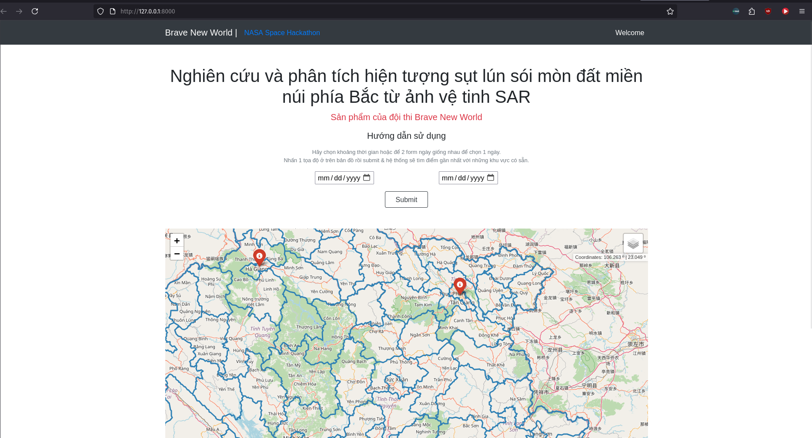
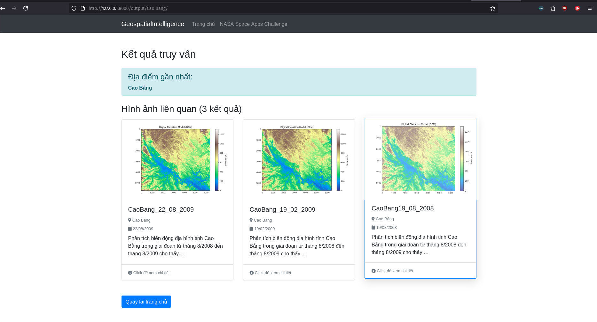
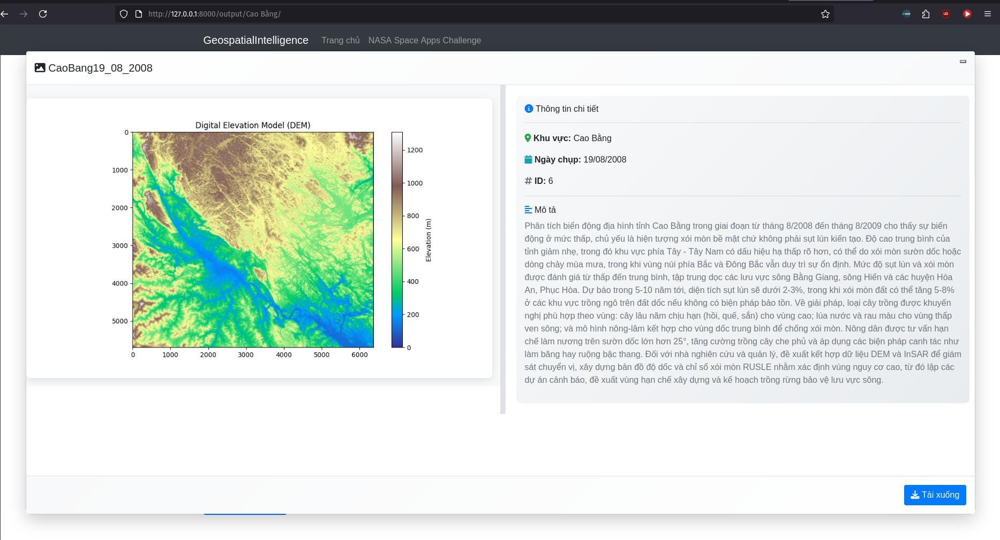

# Land subsidence tracking system - Brave New World

## About us and our project

We are Brave New World, a team of students from SPARC Lab, Hanoi University of Science and 
Techonology participating in this year NASA Space Apps Challenge 2025.

*Update on 29th, November, 2025*: our team won the first prize of our local event and and became one of the global 
nominees. The result for global finalists and honorable mentions is out, and that also concludes the journey with
this Hackathon. Personally, this is is the first Hackathon I ever participated and the experience was very special for me.
This website will soon be shutdown to save some credits.

This is our website built with Django intended to be used for analysis of land subsidence.
The website is currently hosted on https://bravenewworldsparc.dev/
Right now, the supported location are Cao Bang, Ha Giang and Son La of Vietnam, and please choose a 
time range that has the year from 2007 onwards.

The user can pick a location on the map and the system will detect the if the data is available for
that location. The date range is also needed so the outdated data can be removed. 

Since computing from raw SLC images from satellites can be resource-extensive, we 
have already processed some data for the locations above. The satellite we are using is ALOS PALSAR for DEM, Sentinnel 1 and 2 for SAR image processing.

The data that is displayed on our website is processed by ESA SNAP for interferogram showing ground deformation, and some DEM model for
better visualization (a 3D dem model is provided through 3JS QGIS plugin).

## Contribution
You can contribute to the project by cloning this repo and run it.
You need Postgresql with PostGis extension.

Additionally, we would also like to combine Machine Learning or AI model for land subsidence 
prediction, but we haven't been able to implement such a model in such a short time.

Anyways, to run the code, ensure you have Python venv and a PostgreSQL database and PostGis matches the one in the setting.py .

```
pip freeze > requirementrequirements.txt
cd ./geoview
python manage.py runserver
```

## Illustration




